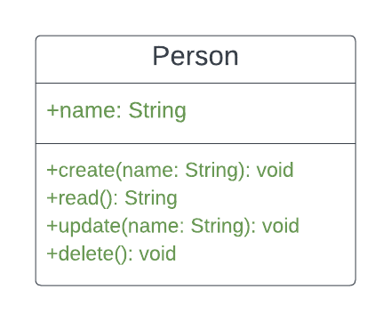

# Express CRUD API

An Express.js CRUD (Create, Read, Update, Delete) API for managing resources with a "name" attribute.

## Table of Contents

- [Prerequisites](#prerequisites)
- [Getting Started](#getting-started)
  - [Installation](#installation)
  - [Configuration](#configuration)
- [Running the API](#running-the-api)
- [Endpoints](#endpoints)

## Prerequisites

Before you begin, ensure you have met the following requirements:

- Node.js and npm installed. [Download Node.js](https://nodejs.org/)

## Getting Started

### Installation

1. Clone the repository:

   - git clone <repository-url>
   - cd express-crud-api

2. Install dependencies:

   - npm install

### Configuration

- Create a `.env` file in the project root and configure environment-specific variables there.
- ### Example
  - PORT=3000
  - MONGO_URI=mongodb://localhost:27017/hng`

### Running the API

Start the API locally using the following commands:

    - npm start
    - npm run dev

The API will be accessible at http://localhost:3000 by default.

## Endpoints

The base URL for all API endpoints is: [https://](https://hngtask2-08s5.onrender.com)

### 1. Create a New User

- **Endpoint:** `/api`
- **HTTP Method:** POST
- **Url**: [https:///api](https://hngtask2-08s5.onrender.com/api)
- **Request Body**: JSON with a "name" field

- **Example**:
  ```json
  {
    "name": "Mark Brown"
  }
  ```

### 2. Read User Data

- **Endpoint:** `/{userId}`
- **HTTP Method:** GET
- **Url**: [https:///api/{userId}](https://hngtask2-08s5.onrender.com/api/{userId})

  - on success:

  ```json
  {
    "id": "12345",
    "name": "Mark Brown"
  }
  ```

### 3. Update User Data

- **Endpoint**: `/{userId}`
- **HTTP Method:** PUT
- **Url**: [https:///api/{userId}](https://hngtask2-08s5.onrender.com/api/{userId})
- **Request Body**: JSON with a "name" field

  - **Example**:
    `json
{
  "name": "John Doe"
}
`

### 4. Delete User

- **Endpoint:** `/{userId}`
- **HTTP Method:** DELETE
- **Url**: [https:///api/{userId}](https://hngtask2-08s5.onrender.com/api/{userId})

## UML DIAGRAM



- **Url**: [link to the UML file](https://github.com/debanjo31/hngtask2/blob/main/img/uml.png)
